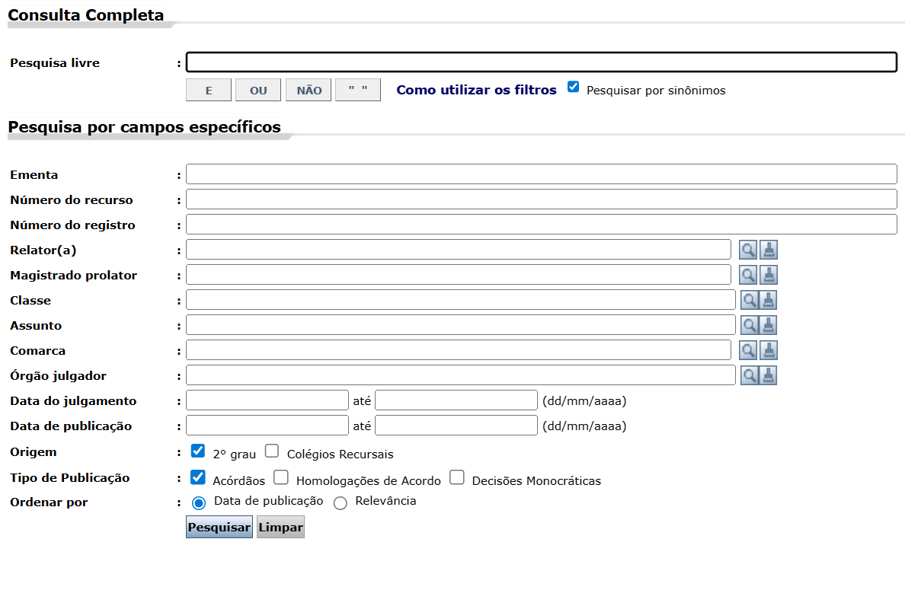

# Pesquisa Empírica

A pesquisa empírica é dividida em 3 etapas:

- **Projeto de Pesquisa**: Hipóteses sobre o funcionamento do mundo
- **Coleta de Dados**
- **Análise de Dados**: Adequação da hipótese inicial

# Projeto de Pesquisa

- **Questionamentos**:
  - **Ex**: Qual a relação entre os valores da causa e o concedido?
- **Teoria**: Resposta conjecturada aos questionamentos
  - **Ex**: Valor da causa próximo àquele concedido em causas similares
  - **Ex**: Valor da causa maximizando ganhos
  - Implicações observáveis / Falseabilidade

- **População**: Escopo da teoria. Elementos aos quais a teoria se aplica
  - **Ex**: Processos civis em São Paulo, iniciados entre os anos 2000 e 2010, em Juizados Especiais Cíveis, em temas de Direito do Consumidor, $\ldots$
  - Espaço
  - Tempo
  - Competência
  - Assunto
  - $\ldots$

# Estratégias para definir a população

## Processos

- **Identificando a População**: Lista de números de processo

# Amostragem

É comum não observarmos todos os elementos da população. **Inferência Estatística** é o conjunto de métodos criados para atingir conclusões sobre a população a partir de observações parciais desta.

Para que seja possível aplicar a Inferência Estatística, os elementos observados devem ter sido escolhidos de uma forma específica. A seguir, estudaremos como realizar esta escolha.

# Referências

